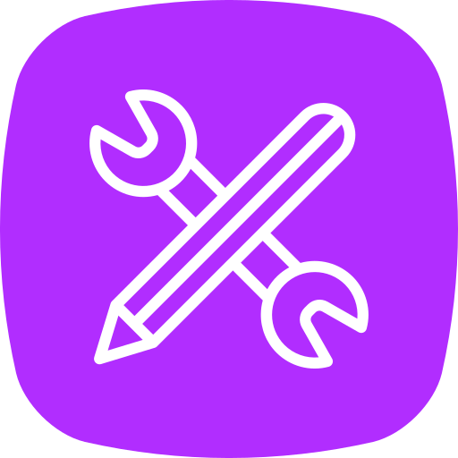
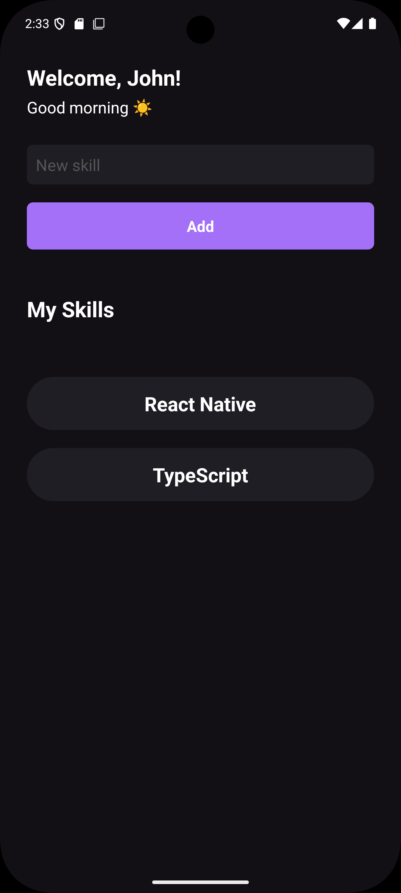

<p align="center">
  
  <br>
</p>

<h3 align="center">
myskills
</h3>

<p align="center">
  
  
  
</p>

**A Mobile Application for Personal Skill Inventory**

## 💡 Overview

The application myskills is a cross-platform mobile application developed using **React Native CLI** that provides users with a dedicated platform to **register their personal and professional skills**.

Tired of forgetting that one specific technology or hobby you picked up? This app acts helping you easily review your full capability set.

<p align="center">
    
    <br>
</p>

## ✨ Key Features

* **Skill Registration:** Easily add new skills with names (e.g., Programming, Language, Soft Skill).

## 🏗️ Technical Stack

This project was bootstrapped using the **React Native CLI** method, ensuring fine-grained control over native modules and performance.

* **Framework:** [React Native](https://reactnative.dev/) (using the CLI setup)
* **Language:** [TypeScript](https://www.typescriptlang.org/)
* **Styling:** [StyleSheet](https://reactnative.dev/docs/stylesheet)

## ⚙️ Local Development & Setup

Follow these instructions to get a copy of the project up and running on your local machine for development and testing.

### Prerequisites

You need to have the following installed:

1.  **Node.js** (LTS version recommended)
2.  **Yarn** or **npm**
3.  **React Native Environment:** Follow the official guide for setting up the **React Native CLI** development environment for **Android** and/or **iOS**.

### Installation

1.  **Clone the repository:**
    ```bash
    git clone https://github.com/filipebteixeira98/myskills
    cd myskills
    ```

2.  **Install dependencies:**
    ```bash
    # Using yarn
    yarn install

    # Or using npm
    npm install
    ```

### Running the App

#### Android

```bash
# Start the Metro bundler
yarn start 

# In a new terminal, run the app on an emulator or connected device
yarn android
```

### iOS

**Note: Requires a macOS machine.**

```bash
# Install CocoaPods dependencies:
cd ios && pod install && cd ..

# Start the Metro bundler
yarn start 

# In a new terminal, run the app on a simulator
yarn ios
```

## 🤝 Contribution

Contributions are what make the open-source community such an amazing place to learn, inspire, and create. Any contributions you make are greatly appreciated.

### Fork the Project.

```bash
# Create your Feature Branch
git checkout -b feature/AmazingFeature

# Commit your Changes
git commit -m 'Add some AmazingFeature'

# Push to the Branch 
git push origin feature/AmazingFeature

# Open a Pull Request.
```

## 📄 License

Distributed under the MIT License. See LICENSE for more information.
